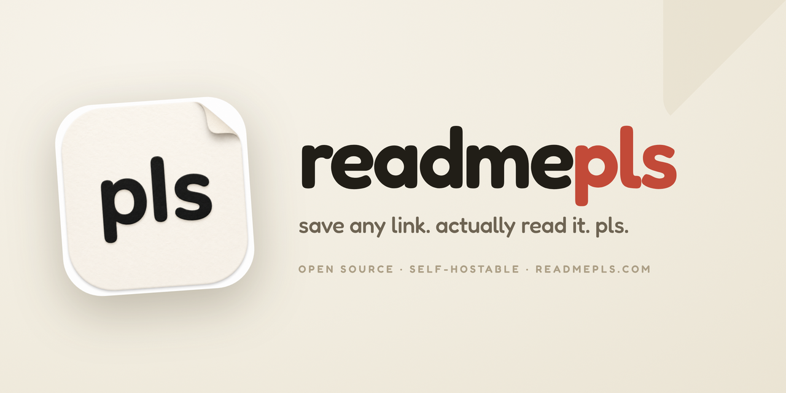

Introducing: `readmepls`, your one-stop app to store, read, highlight, annotate and categorize your favorite articles.

Paste any link to extract the readable content into your library. Also works with Youtube videos!

## No AI? No Problem!
The app has been developed with a simple idea: the free, core version is fully functional and feature complete. No features hidden behind a paywall.
However, subscribing to the Pro version enables a suite of AI features that will make your experience even more enjoyable!

**Updating:** `docker compose pull && docker compose up -d`. Data persists in the
`pb_data` volume.

**Smoke test:** `pnpm smoke` boots the full stack, seeds one job, and asserts the
worker processes it end-to-end (uses a mock AI provider, so no API key is needed).

**Semantic search:** library search is hybrid — every query blends keyword (full-text)
and semantic (meaning-based) matches, so both exact phrases and paraphrases surface.
Embeddings run on a local model (`multilingual-e5-small`, no API key); it downloads
once on the first capture into the `worker_models` volume. To enable the semantic
half, set `WORKER_SEARCH_SECRET` in `.env` (`openssl rand -hex 32`) — the same value
wires the worker's internal `/search` endpoint and the web app that calls it. Leave it
empty to run keyword-only. To embed content you captured before enabling it, set
`BACKFILL_EMBEDDINGS=1` for one worker boot. If the worker is unreachable, search
degrades to keyword-only automatically.

## Running locally (without Docker)

Three processes against one PocketBase superuser shared by the worker and the
web service client.

```bash
# 1. PocketBase (applies migrations on start)
cd pocketbase && ./pocketbase superuser upsert worker@local password12345
./pocketbase serve --http=127.0.0.1:8090

# 2. Worker (new terminal, from repo root) — build once, then run
pnpm --filter @readmepls/worker build
PB_URL=http://127.0.0.1:8090 \
PB_WORKER_EMAIL=worker@local PB_WORKER_PASSWORD=password12345 \
ANTHROPIC_API_KEY=sk-... \
pnpm --filter @readmepls/worker start

# 3. Web (new terminal, from repo root) — service client uses PB_ADMIN_*
PB_URL=http://127.0.0.1:8090 \
PB_ADMIN_EMAIL=worker@local PB_ADMIN_PASSWORD=password12345 \
pnpm --filter @readmepls/web dev
```

## Self Hosting

Wanna build your own, personal library? Got you covered there too — the app
is easily self-hostable, with an optional bring-your-own-key approach to the
AI features. Full walkthrough: [readmepls.com/docs](https://readmepls.com/docs).

1. Grab [`compose.yml`](compose.yml) and [`.env.example`](.env.example) from
   this repo — no need to clone it.
2. Rename `.env.example` to `.env` and fill in the PocketBase admin/worker
   passwords (and, optionally, `ANTHROPIC_API_KEY` to turn AI features on for
   everyone using your instance).
3. `docker compose pull && docker compose up -d`

Data persists in the `pb_data` volume.

**Maintainers:** deploying the gated staging environment (`develop`-branch
images, same VPS as prod)? See [`docs/deploy/staging.md`](docs/deploy/staging.md).

## License

[GNU AGPL-3.0-or-later](LICENSE). You may use, modify, and self-host freely; if you
run a modified version as a network service, you must release your source changes.

Copyright (C) 2026 readmepls authors.
